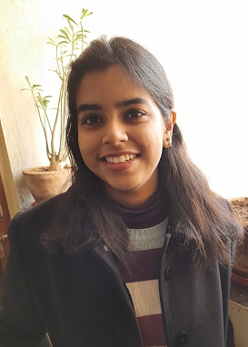
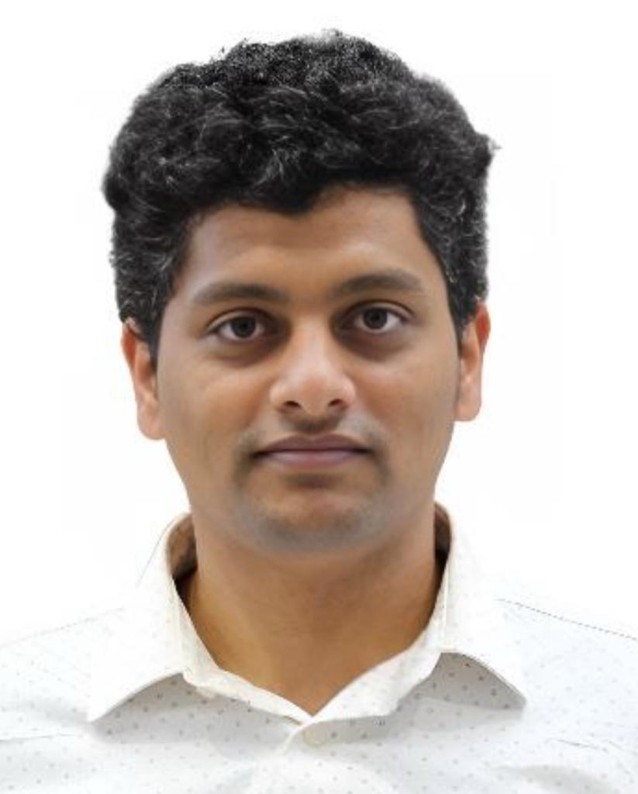

---
format:
  html:
    theme:
      light: flatly
      dark: darkly
    css: styles.css
    page-layout: full
    toc: false
---

::: page-header
# Organizing Committee
:::

:::::: {.grid .g-4}

::: {.g-col-12 .g-col-md-6 .g-col-lg-4}
```{=html}
<div class="committee-profile-card">
  
  <div class="profile-content">
    <h3 class="profile-name">Prof. Suparno Bhattacharyya</h3>
    <p class="profile-role">
      Mechanical Engineering<br>
      Assistant Professor
    </p>
    <a href="https://www.iitism.ac.in/faculty-details?faculty=suparno" class="btn-know-more">Know More <i class="bi bi-arrow-right"></i></a>
  </div>
</div>
```
:::

::: {.g-col-12 .g-col-md-6 .g-col-lg-4}
```{=html}
<div class="committee-profile-card">
  
  <div class="profile-content">
    <h3 class="profile-name">Prof. Aditi Sengupta</h3>
    <p class="profile-role">
      Mechanical Engineering<br>
      Assistant Professor
    </p>
    <a href="https://www.iitism.ac.in/faculty-details?faculty=aditi" class="btn-know-more">Know More <i class="bi bi-arrow-right"></i></a>
  </div>
</div>
```
:::

::: {.g-col-12 .g-col-md-6 .g-col-lg-4}
```{=html}
<div class="committee-profile-card">
  
  <div class="profile-content">
    <h3 class="profile-name">Prof. Omkar Mypati</h3>
    <p class="profile-role">
      Mechanical Engineering<br>
      Assistant Professor
    </p>
    <a href="https://www.iitism.ac.in/faculty-details?faculty=omkarmypati" class="btn-know-more">Know More <i class="bi bi-arrow-right"></i></a>
  </div>
</div>
```
:::


::::::
