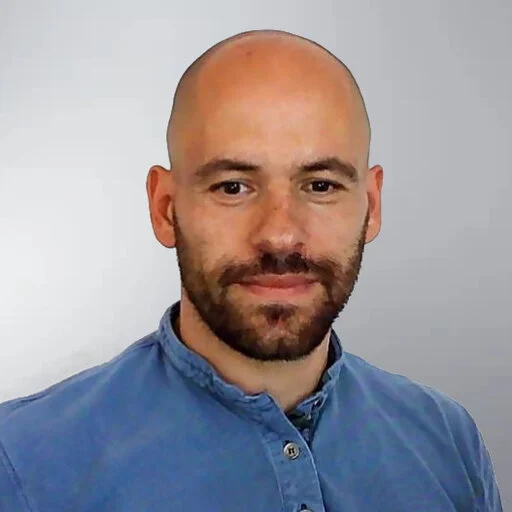
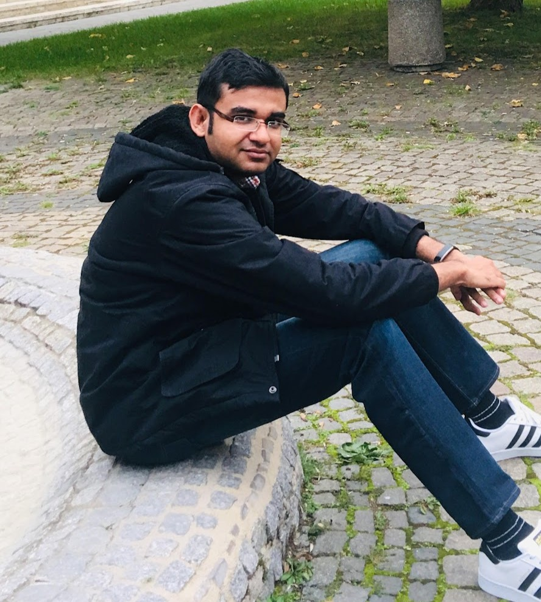
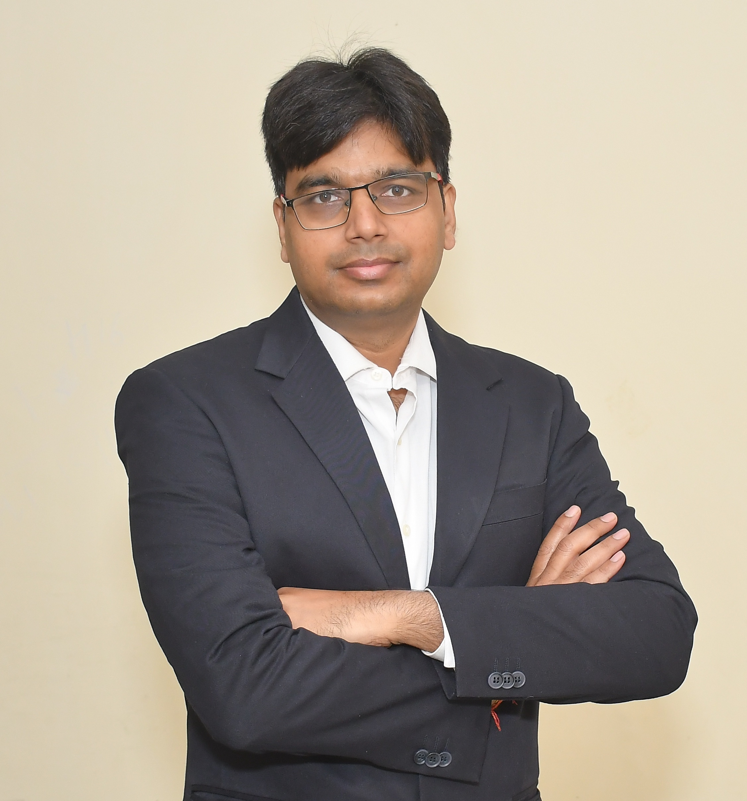
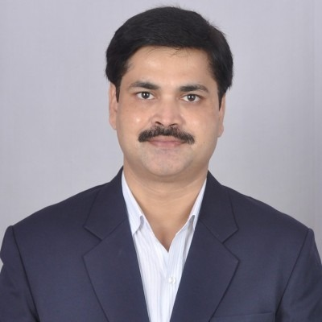

---
format:
  html:
    theme:
      light: flatly
      dark: darkly
    css: styles.css
    page-layout: full
    toc: false
---

::: page-header
# Keynote Speakers
:::

::::: {.grid .g-4}
::: {.g-col-12 .g-col-md-6 .g-col-lg-4}
```{=html}
<div class="committee-profile-card">
  
  <div class="profile-content">
    <h3 class="profile-name">Prof. Francesco Ballarin</h3>
    <p class="profile-role">
      Università Cattolica del Sacro Cuore<br>
      Associate Professor
    </p>
    <a href="https://www.francescoballarin.it/" class="btn-know-more">Know More <i class="bi bi-arrow-right"></i></a>
  </div>
</div>
```
:::

::: {.g-col-12 .g-col-md-6 .g-col-lg-4}
```{=html}
<div class="committee-profile-card">
  
  <div class="profile-content">
    <h3 class="profile-name">Prof. Giovanni Stabile</h3>
    <p class="profile-role">
      Sant'Anna School of Advanced Studies<br>
      Associate Professor
    </p>
    <a href="https://www.giovannistabile.com/" class="btn-know-more">Know More <i class="bi bi-arrow-right"></i></a>
  </div>
</div>
```
:::

::: {.g-col-12 .g-col-md-6 .g-col-lg-4}
```{=html}
<div class="committee-profile-card">
  
  <div class="profile-content">
    <h3 class="profile-name">Dr. Chris Rackauckas </h3>
    <p class="profile-role">
      Massachusetts Institute of Technology<br>
      Research Affiliate
    </p>
    <a href="https://chrisrackauckas.com/" class="btn-know-more">Know More <i class="bi bi-arrow-right"></i></a>
  </div>
</div>
```
:::

::: {.g-col-12 .g-col-md-6 .g-col-lg-4}
```{=html}
<div class="committee-profile-card">
  
  <div class="profile-content">
    <h3 class="profile-name">Prof. Souvik Chakraborty</h3>
    <p class="profile-role">
      IIT Delhi<br>
      Associate Professor
    </p>
    <a href="https://www.csccm.in/our-team" class="btn-know-more">Know More <i class="bi bi-arrow-right"></i></a>
  </div>
</div>
```
:::

::: {.g-col-12 .g-col-md-6 .g-col-lg-4}
```{=html}
<div class="committee-profile-card">
  
  <div class="profile-content">
    <h3 class="profile-name">Prof. Rajesh Ranjan</h3>
    <p class="profile-role">
      IIT Kanpur<br>
      Associate Professor
    </p>
    <a href="https://home.iitk.ac.in/~rajeshr/" class="btn-know-more">Know More <i class="bi bi-arrow-right"></i></a>
  </div>
</div>
```
:::

::: {.g-col-12 .g-col-md-6 .g-col-lg-4}
```{=html}
<div class="committee-profile-card">
  
  <div class="profile-content">
    <h3 class="profile-name">Mr. Chandra Bhushan</h3>
    <p class="profile-role">
      Chief Iron Making Mechanical maintenance TSJ,<br> 
      Chief Shared Services, TSMD Kharagpur
    </p>
  </div>
</div>
```
:::

::: {.g-col-12 .g-col-md-6 .g-col-lg-4}
```{=html}
<div class="committee-profile-card">
  
  <div class="profile-content">
    <h3 class="profile-name">Comsol</h3>
    <p class="profile-role">
      Software for Multiphysics Simulation
    </p>
    <a href="https://www.comsol.com/products" class="btn-know-more">Know More <i class="bi bi-arrow-right"></i></a>
  </div>
</div>
```
:::
:::::
