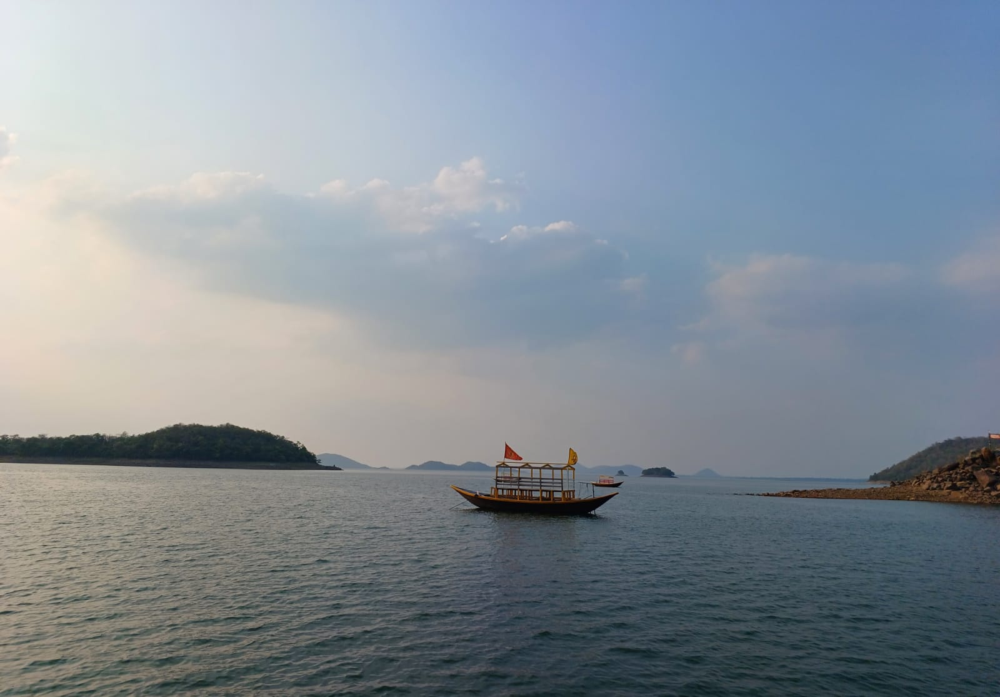
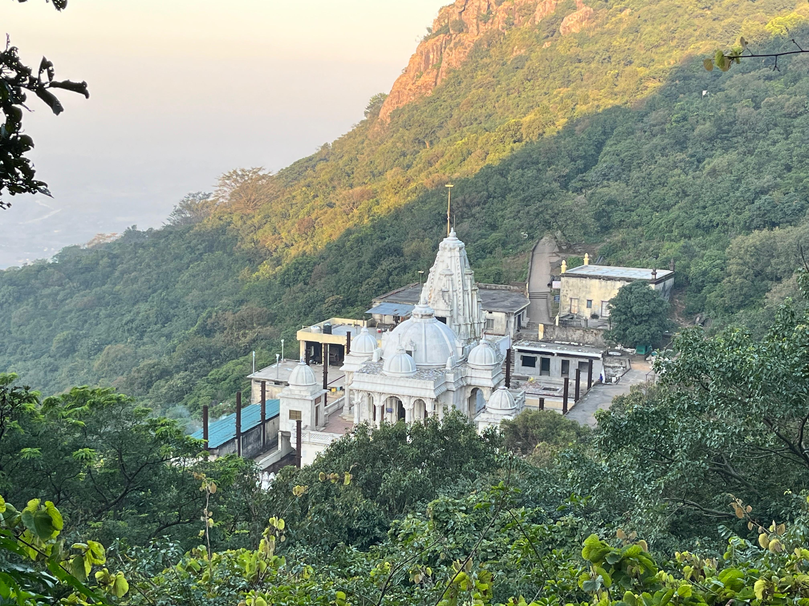
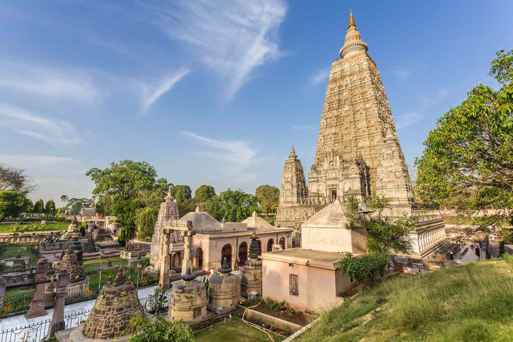
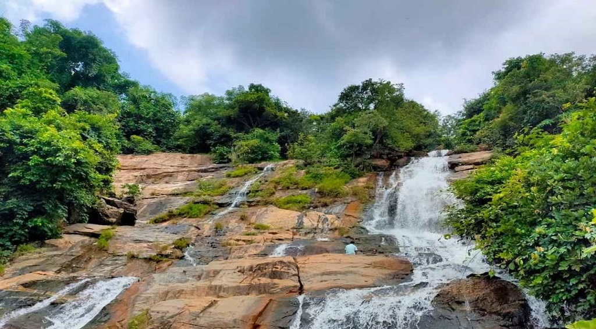
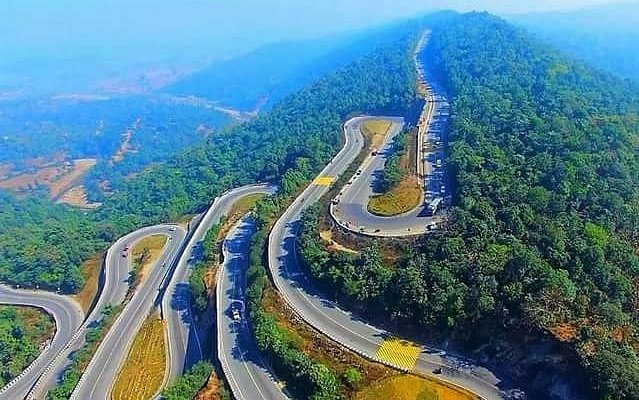

---
format:
  html:
    theme:
      light: flatly
    css: styles.css
    page-layout: full
    toc: false
---

::: page-header
# Travel & Accommodation
:::

### How to Reach IIT(ISM) Dhanbad

::::::::: {.grid .text-center .travel-section}
:::: {.g-col-12 .g-col-md-4 .travel-card}
::: icon-box
<i class="bi bi-train-front-fill"></i>
:::

### By Rail

**Dhanbad Jn.** (2.8 km away) is the largest station in the state with direct trains to almost every major city. Taxis, Autos, and Ola cabs are available 24/7.
::::

:::: {.g-col-12 .g-col-md-4 .travel-card}
::: icon-box
<i class="bi bi-bus-front-fill"></i>
:::

### By Road

Connected via **NH-18 & NH-19**. Seamless bus connectivity to Ranchi, Kolkata, Jamshedpur, and Bokaro.
::::

:::: {.g-col-12 .g-col-md-4 .travel-card}
::: icon-box
<i class="bi bi-airplane-fill"></i>
:::

### By Air

Nearest Airports: \* **Durgapur (RDP):** 85 km \* **Deoghar (DGH):** 110 km \* **Ranchi (IXR):** 140 km \* **Kolkata (CCU):** 269 km
::::
:::::::::

::: {.map-container .mt-5 .mb-5}
<iframe src="https://www.google.com/maps/embed?pb=!1m18!1m12!1m3!1d3650.1185838921524!2d86.43901351498244!3d23.814381884557864!2m3!1f0!2f0!3f0!3m2!1i1024!2i768!4f13.1!3m3!1m2!1s0x39f6bc9fac678481%3A0x122cb1d133a89995!2sIIT%20(ISM)%20Dhanbad!5e0!3m2!1sen!2sin!4v1675762562854!5m2!1sen!2sin" width="100%" height="400" style="border:0;" allowfullscreen loading="lazy">

</iframe>
:::

### Accommodation

::: {.callout-note .hostel-note appearance="simple" icon="false"}
### 🏨 Institute Accommodation

Participants will be provided **single/double occupancy accommodation** in IIT(ISM) Hostels and Guest House at nominal charges. A Google Form for booking will be shared shortly.
:::

::::::::::::: {.grid .g-4}
::: {.g-col-12 .g-col-md-6 .g-col-lg-4}
```{=html}
<div class="hotel-card-simple">
  <div>
    <h4 class="hotel-name">Hotel Townhouse Oak</h4>
    <div class="hotel-meta mb-4">
      <i class="bi bi-geo-alt-fill text-danger"></i> 
      <span><strong>2.6 km</strong> from Campus</span>
    </div>
  </div>
  <a href="https://www.google.com/maps/place/Townhouse+Oak+Dhanbad+Near+SSLNT+College+formerly+Kapson/@23.8063662,86.4292454,3196m/data=!3m2!1e3!5s0x39f6bb879a9eb923:0xc681927ec3b0fc37!4m26!1m16!4m15!1m6!1m2!1s0x39f6bc9fac678481:0x122cb1d133a89995!2sIndian+Institute+of+Technology+(Indian+School+of+Mines),+Dhanbad,+shop+no.+4,+IIT+ISM+Rd,+IIT+(ISM,+Sardar+Patel+Nagar,+Kalyanpur,+Dhanbad,+Jharkhand+826007,+India!2m2!1d86.441249!2d23.8144169!1m6!1m2!1s0x39f6bde694de1683:0x7faec0b83583eaf1!2sTownhouse+Oak+Dhanbad+Near+SSLNT+College+formerly+Kapson,+Sinha+Gas+Agency,+Plot+Number+823,+Luby+Circular+Rd,+behind+SSLNT+College+Road,+Hirapur,+Kasturba+Nagar,+Dhanbad,+Jharkhand+826007,+India!2m2!1d86.4358286!2d23.8005949!3e0!3m8!1s0x39f6bde694de1683:0x7faec0b83583eaf1!5m2!4m1!1i2!8m2!3d23.8005949!4d86.4358286!16s%2Fg%2F11l73w5zvk?entry=ttu&g_ep=EgoyMDI2MDIyNS4wIKXMDSoASAFQAw%3D%3D"_blank" class="btn-location text-center w-100"><i class="bi bi-map"></i> Location Map</a>
</div>
```
:::

::: {.g-col-12 .g-col-md-6 .g-col-lg-4}
```{=html}
<div class="hotel-card-simple">
  <div>
    <h3 class="hotel-name">Hotel Triotel</h3>
    <div class="hotel-meta mb-4">
      <i class="bi bi-geo-alt-fill text-danger"></i> 
      <span><strong>2.6 km</strong> from Campus</span>
    </div>
  </div>
  <a href="https://www.google.com/maps/place/Hotel+Triotel/@23.8118108,86.4408291,1770m/data=!3m1!1e3!4m26!1m16!4m15!1m6!1m2!1s0x39f6bc9fac678481:0x122cb1d133a89995!2sIIT(ISM)+DHANBAD,+IIT+ISM+Road,+IIT+(ISM,+Sardar+Patel+Nagar,+Kalyanpur,+Jharkhand!2m2!1d86.441249!2d23.8144169!1m6!1m2!1s0x39f6bc80a9e5a185:0xb6d9cd12a8a359c9!2sHotel+Triotel,+Main+Road,+near+Sigma+Education,+Kusum+Vihar,+Murli+Nagar,+Saraidhella,+Jharkhand!2m2!1d86.4537291!2d23.8112182!3e0!3m8!1s0x39f6bc80a9e5a185:0xb6d9cd12a8a359c9!5m2!4m1!1i2!8m2!3d23.8112182!4d86.4537291!16s%2Fg%2F11f03rckpk?entry=ttu&g_ep=EgoyMDI1MDgzMC4wIKXMDSoASAFQAw%3D%3D"_blank" class="btn-location text-center w-100"><i class="bi bi-map"></i> Location Map</a>
</div>
```
:::

::: {.g-col-12 .g-col-md-6 .g-col-lg-4}
```{=html}
<div class="hotel-card-simple">
  <div>
    <h3 class="hotel-name">Hotel The Aura</h3>
    <div class="hotel-meta mb-4">
      <i class="bi bi-geo-alt-fill text-danger"></i> 
      <span><strong>2.9 km</strong> from Campus</span>
    </div>
  </div>
  <a href="https://www.google.com/maps/place/THE+AURA/@23.81201,86.4468099,1598m/data=!3m2!1e3!5s0x39f6bb879a9eb923:0xc681927ec3b0fc37!4m26!1m16!4m15!1m6!1m2!1s0x39f6bc9fac678481:0x122cb1d133a89995!2sIndian+Institute+of+Technology+(Indian+School+of+Mines),+Dhanbad,+shop+no.+4,+IIT+ISM+Rd,+IIT+(ISM,+Sardar+Patel+Nagar,+Kalyanpur,+Dhanbad,+Jharkhand+826007,+India!2m2!1d86.441249!2d23.8144169!1m6!1m2!1s0x39f6bd5113c5e053:0x6b0fd67582728b90!2sTHE+AURA,+near+guru+kirpa+showroom,+Shanti+Colony,+Saraidhella,+Dhanbad,+Jharkhand+826007,+India!2m2!1d86.4625605!2d23.8147767!3e0!3m8!1s0x39f6bd5113c5e053:0x6b0fd67582728b90!5m2!4m1!1i2!8m2!3d23.8147767!4d86.4625605!16s%2Fg%2F11tnxnylbk?entry=ttu&g_ep=EgoyMDI2MDIyNS4wIKXMDSoASAFQAw%3D%3D" target="_blank" class="btn-location text-center w-100"><i class="bi bi-map"></i> Location Map</a>
</div>
```
:::

::: {.g-col-12 .g-col-md-6 .g-col-lg-4}
```{=html}
<div class="hotel-card-simple">
  <div>
    <h3 class="hotel-name">Hotel Cocoon</h3>
    <div class="hotel-meta mb-4">
      <i class="bi bi-geo-alt-fill text-danger"></i> 
      <span><strong>3.5 km</strong> from Campus</span>
    </div>
  </div>
  <a href="https://www.google.com/maps/place/Cocoon/@23.8075415,86.4246923,15z/data=!3m1!5s0x39f6bb879a9eb923:0xc681927ec3b0fc37!4m26!1m16!4m15!1m6!1m2!1s0x39f6bc9fac678481:0x122cb1d133a89995!2sIIT(ISM)+DHANBAD,+IIT+ISM+Road,+IIT+(ISM,+Sardar+Patel+Nagar,+Kalyanpur,+Jharkhand!2m2!1d86.441249!2d23.8144169!1m6!1m2!1s0x39f6bcb741ff1c2b:0x5fda8315d3dedb2e!2sCocoon,+beside+Puja+Talkies,+Forest+Colony,+Dhanbad,+Jharkhand!2m2!1d86.4277949!2d23.7980718!3e0!3m8!1s0x39f6bcb741ff1c2b:0x5fda8315d3dedb2e!5m2!4m1!1i2!8m2!3d23.7980718!4d86.4277949!16s%2Fg%2F1tkc0jdz?entry=ttu&g_ep=EgoyMDI1MDIyNi4wIKXMDSoASAFQAw%3D%3D" target="_blank" class="btn-location text-center w-100"><i class="bi bi-map"></i> Location Map</a>
</div>
```
:::

::: {.g-col-12 .g-col-md-6 .g-col-lg-4}
```{=html}
<div class="hotel-card-simple">
  <div>
    <h3 class="hotel-name">Hotel The Venue</h3>
    <div class="hotel-meta mb-4">
      <i class="bi bi-geo-alt-fill text-danger"></i> 
      <span><strong>3.5 km</strong> from Campus</span>
    </div>
  </div>
  <a href="https://www.google.com/maps/place/Hotel+The+Venue/@23.8088725,86.4268095,3196m/data=!3m2!1e3!5s0x39f6bb879a9eb923:0xc681927ec3b0fc37!4m26!1m16!4m15!1m6!1m2!1s0x39f6bc9fac678481:0x122cb1d133a89995!2sIndian+Institute+of+Technology+(Indian+School+of+Mines),+Dhanbad,+shop+no.+4,+IIT+ISM+Rd,+IIT+(ISM,+Sardar+Patel+Nagar,+Kalyanpur,+Dhanbad,+Jharkhand+826007!2m2!1d86.441249!2d23.8144169!1m6!1m2!1s0x39f6bdc0f2dbd54f:0x16d41f1ad3bdf470!2sHotel+The+Venue,+RC4J%2BMJR,+Bartand,+Jharudih,+Dhanbad,+Jharkhand+826007!2m2!1d86.4314735!2d23.8068118!3e0!3m8!1s0x39f6bdc0f2dbd54f:0x16d41f1ad3bdf470!5m2!4m1!1i2!8m2!3d23.8068118!4d86.4314735!16s%2Fg%2F11k3q5_5jx?entry=ttu&g_ep=EgoyMDI2MDIxOC4wIKXMDSoASAFQAw%3D%3D" target="_blank" class="btn-location text-center w-100"><i class="bi bi-map"></i> Location Map</a>
</div>
```
:::

::: {.g-col-12 .g-col-md-6 .g-col-lg-4}
```{=html}
<div class="hotel-card-simple">
  <div>
    <h3 class="hotel-name">Hotel SG International</h3>
    <div class="hotel-meta mb-4">
      <i class="bi bi-geo-alt-fill text-danger"></i> 
      <span><strong>3.5 km</strong> from Campus</span>
    </div>
  </div>
  <a href="https://www.google.com/maps/place/SG+International+Hotel/@23.8067905,86.4308849,2867m/data=!3m1!1e3!4m36!1m26!4m25!1m16!1m2!1s0x39f6bc9fac678481:0x122cb1d133a89995!2sIIT(ISM)+DHANBAD,+IIT+ISM+Road,+IIT+(ISM,+Sardar+Patel+Nagar,+Kalyanpur,+Jharkhand!2m2!1d86.441249!2d23.8144169!3m4!1m2!1d86.4309569!2d23.8050717!3s0x39f6bcbad6cbd74f:0x649f0d4f04e0c46d!3m4!1m2!1d86.4324812!2d23.8110044!3s0x39f6bca422f23c5f:0x99eddc0aae97448a!1m6!1m2!1s0x39f6bd1dce4b92ff:0x15efb45778e049b7!2sSG+International+Hotel,+Barwa+Road,+opposite+CMRI+Gate,+Surya+Vihar+Colony,+Dhaiya,+Dhanbad,+Jharkhand!2m2!1d86.4330863!2d23.8108219!3e0!3m8!1s0x39f6bd1dce4b92ff:0x15efb45778e049b7!5m2!4m1!1i2!8m2!3d23.8108093!4d86.4331599!16s%2Fg%2F11q9rd3p3d?entry=ttu&g_ep=EgoyMDI1MDgzMC4wIKXMDSoASAFQAw%3D%3D" target="_blank" class="btn-location text-center w-100"><i class="bi bi-map"></i> Location Map</a>
</div>
```
:::

::: {.g-col-12 .g-col-md-6 .g-col-lg-4}
```{=html}
<div class="hotel-card-simple">
  <div>
    <h3 class="hotel-name">Hotel Sonotel</h3>
    <div class="hotel-meta mb-4">
      <i class="bi bi-geo-alt-fill text-danger"></i> 
      <span><strong>3.9 km</strong> from Campus</span>
    </div>
  </div>
  <a href="https://www.google.com/maps/place/Sonotel+Luxury+Business+Hotel+%26+Resorts,+Dhanbad/@23.8207801,86.4697492,17z/data=!3m1!4b1!4m9!3m8!1s0x39f6bb887d2e71a1:0xb74638ff3c99a7b1!5m2!4m1!1i2!8m2!3d23.8207801!4d86.4697492!16s%2Fg%2F119t8tqtr?entry=ttu&g_ep=EgoyMDI1MDIyNi4wIKXMDSoASAFQAw%3D%3D" target="_blank" class="btn-location text-center w-100"><i class="bi bi-map"></i> Location Map</a>
</div>
```
:::

::: {.g-col-12 .g-col-md-6 .g-col-lg-4}
```{=html}
<div class="hotel-card-simple">
  <div>
    <h3 class="hotel-name">Hotel 17 Degrees</h3>
    <div class="hotel-meta mb-4">
      <i class="bi bi-geo-alt-fill text-danger"></i> 
      <span><strong>5.7 km</strong> from Campus</span>
    </div>
  </div>
  <a href="https://www.google.com/maps/place/Seventeen+Degrees+Hotel/@23.7825023,86.4127711,1598m/data=!3m1!1e3!4m20!1m10!3m9!1s0x39f6a33272997659:0x52b282394736ba6a!2sSeventeen+Degrees+Hotel!5m2!4m1!1i2!8m2!3d23.7824974!4d86.4153514!16s%2Fg%2F1tdr1pdj!3m8!1s0x39f6a33272997659:0x52b282394736ba6a!5m2!4m1!1i2!8m2!3d23.7824974!4d86.4153514!16s%2Fg%2F1tdr1pdj?entry=ttu&g_ep=EgoyMDI2MDIyNS4wIKXMDSoASAFQAw%3D%3D" target="_blank" class="btn-location text-center w-100"><i class="bi bi-map"></i> Location Map</a>
</div>
```
:::

::: {.g-col-12 .g-col-md-6 .g-col-lg-4}
```{=html}
<div class="hotel-card-simple">
  <div>
    <h3 class="hotel-name">Hotel Coal Capital</h3>
    <div class="hotel-meta mb-4">
      <i class="bi bi-geo-alt-fill text-danger"></i> 
      <span><strong>5.8 km</strong> from Campus</span>
    </div>
  </div>
  <a href="https://www.google.com/maps/place/Hotel+Coal+Capital/@23.7877206,86.4130375,221m/data=!3m1!1e3!4m21!1m11!3m10!1s0x39f6a32df1003a97:0x488fc91d16c3546d!2sHotel+Coal+Capital!5m2!4m1!1i2!8m2!3d23.7876978!4d86.4131809!10e5!16s%2Fg%2F11hz383_7p!3m8!1s0x39f6a32df1003a97:0x488fc91d16c3546d!5m2!4m1!1i2!8m2!3d23.7876978!4d86.4131809!16s%2Fg%2F11hz383_7p?entry=ttu&g_ep=EgoyMDI1MDMwNC4wIKXMDSoASAFQAw%3D%3D" target="_blank" class="btn-location text-center w-100"><i class="bi bi-map"></i> Location Map</a>
</div>
```
:::

::: {.g-col-12 .g-col-md-6 .g-col-lg-4}
```{=html}
<div class="hotel-card-simple">
  <div>
    <h3 class="hotel-name">Hotel SB International</h3>
    <div class="hotel-meta mb-4">
      <i class="bi bi-geo-alt-fill text-danger"></i> 
      <span><strong>5.9 km</strong> from Campus</span>
    </div>
  </div>
  <a href="https://www.google.com/maps/place/SB+International+Hotel+and+Banquet+-+Best+Hotel+in+Hirak+Road+Dhanbad%2F+Best+Banquet+Hall+in+Dhanbad/@23.8243288,86.4623222,1598m/data=!3m1!1e3!4m20!1m10!3m9!1s0x39f6bbe2aec44e6d:0x5e2b9a09c6ead6d0!2sSB+International+Hotel+and+Banquet+-+Best+Hotel+in+Hirak+Road+Dhanbad%2F+Best+Banquet+Hall+in+Dhanbad!5m2!4m1!1i2!8m2!3d23.8243239!4d86.4649025!16s%2Fg%2F11vjp5lrjv!3m8!1s0x39f6bbe2aec44e6d:0x5e2b9a09c6ead6d0!5m2!4m1!1i2!8m2!3d23.8243239!4d86.4649025!16s%2Fg%2F11vjp5lrjv?entry=ttu&g_ep=EgoyMDI2MDIyNS4wIKXMDSoASAFQAw%3D%3D" target="_blank" class="btn-location text-center w-100"><i class="bi bi-map"></i> Location Map</a>
</div>
```
:::
:::::::::::::

## Places to See Nearby

::::::::::::::::::::::::::::::::: {.grid .g-4}
::::::: {.g-col-12 .g-col-md-4}
:::::: places-card
:::: places-img-wrapper


::: places-header
DEOGHAR
:::
::::

::: places-body
<p>Deoghar is a prominent pilgrimage destination in Jharkhand, India. At its heart lies the revered Baba Baidyanath Dham temple, one of the twelve Jyotirlingas dedicated to Lord Shiva, attracting devotees from across the nation. Beyond its spiritual significance, Deoghar offers a blend of natural beauty. The Trikut Pahar, with its trio of peaks and the Tapovan caves offer a panoramic view of the surrounding landscape. The Naulakha Temple stands as a testament to intricate craftsmanship and is dedicated to Radha and Krishna. The distance between Dhanbad and Deoghar is 120 km, and can be reached via taxi in 3 hrs.</p>
:::
::::::
:::::::

::::::: {.g-col-12 .g-col-md-4}
:::::: places-card
:::: places-img-wrapper


::: places-header
MAITHON LAKE
:::
::::

::: places-body
<p>Maithon Lake, located approximately 48 km from Dhanbad in Jharkhand, is a serene reservoir formed by the Maithon Dam on the Barakar River. Visitors can engage in activities such as boating and fishing, or simply relax amidst the lush green surroundings. Nearby attractions include the Kalyaneshwari Temple, an ancient shrine dedicated to Goddess Kalyaneshwari, and a deer park that houses over 50 deer, providing additional points of interest for tourists. The drive typically takes around an hour, with well-maintained routes via NH19 and SH5.</p>
:::
::::::
:::::::

::::::: {.g-col-12 .g-col-md-4}
:::::: places-card
:::: places-img-wrapper


::: places-header
PARASNATH HILLS
:::
::::

::: places-body
<p>Parasnath Hills, located in Jharkhand's Giridih district, stands as the state's highest peak at 1,350 meters. This revered site is a significant pilgrimage destination for Jains, known as Shikharji, where twenty of the twenty-four Tirthankaras are believed to have attained salvation. The hills are adorned with numerous ancient Jain temples, making it a spiritual haven for devotees. Traveling from Dhanbad to Parasnath Hills by taxi covers approximately 50 km and typically takes around 45 minutes via NH19.</p>
:::
::::::
:::::::

::::::: {.g-col-12 .g-col-md-4}
:::::: places-card
:::: places-img-wrapper


::: places-header
BODHGAYA
:::
::::

::: places-body
<p>Bodh Gaya, located in Bihar, India, is a significant pilgrimage site where Siddhartha Gautama attained enlightenment beneath the Bodhi Tree, becoming the Buddha. The Mahabodhi Temple Complex, a UNESCO World Heritage Site, encompasses the revered Bodhi Tree and several ancient structures that offer insight into Buddhist heritage. Traveling from Dhanbad to Bodh Gaya covers approximately 208 kilometers by road, typically taking around 3 hours. The journey can be undertaken via private car or taxi. Alternatively, regular train services connect Dhanbad Junction to Gaya Junction, followed by a short 12-kilometer drive to Bodh Gaya.</p>
:::
::::::
:::::::

::::::: {.g-col-12 .g-col-md-4}
:::::: places-card
:::: places-img-wrapper


::: places-header
PURULIA
:::
::::

::: places-body
<p>Ajodhya Hills, located in the Purulia district of West Bengal, is a picturesque destination known for its lush forests, rolling hills, and serene waterfalls. This area offers a tranquil retreat for nature enthusiasts and adventure seekers alike. Visitors can explore attractions such as Bamni Falls, Turga Dam, and the Upper and Lower Dams, which provide breathtaking views and opportunities for outdoor activities. Traveling from Dhanbad to Ajodhya Hills by taxi covers approximately 101 kilometers and typically takes around 3 hours.</p>
:::
::::::
:::::::

::::::: {.g-col-12 .g-col-md-4}
:::::: places-card
:::: places-img-wrapper


::: places-header
RANCHI
:::
::::

::: places-body
<p>Ranchi, the capital city of Jharkhand, is renowned for its picturesque landscapes, encompassing cascading waterfalls, lush green valleys, and rich cultural heritage. Notable attractions include the majestic Dassam Falls, the serene Ranchi Lake, and the historic Jagannath Temple, each offering unique experiences for visitors. Traveling from Dhanbad to Ranchi covers approximately 150 km and can be reached via train or taxi in 4 hrs.</p>
:::
::::::
:::::::
:::::::::::::::::::::::::::::::::
